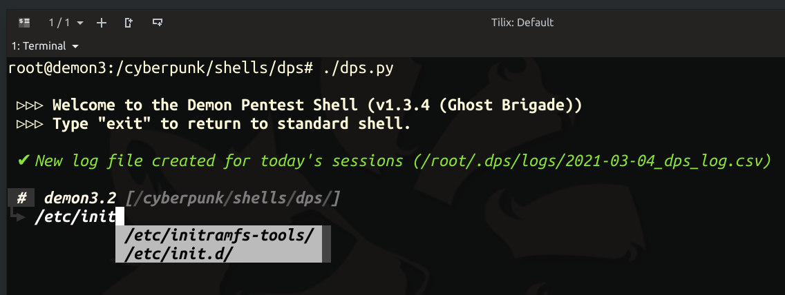
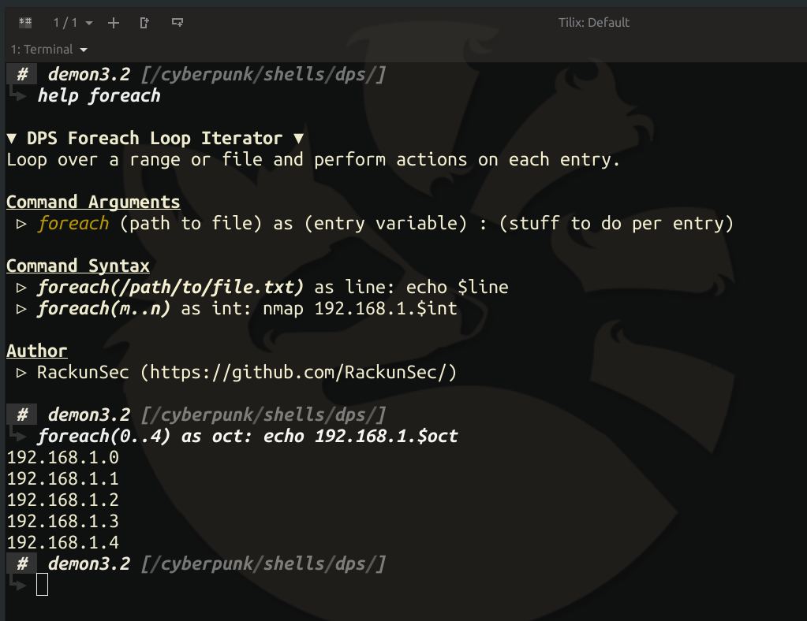
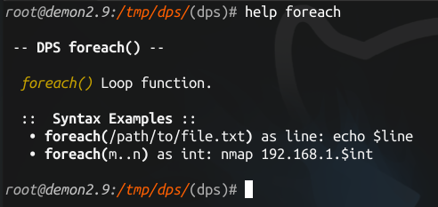
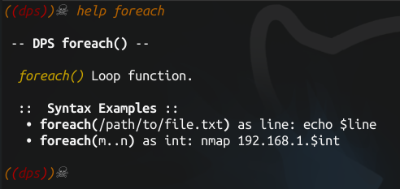
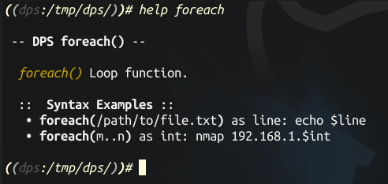
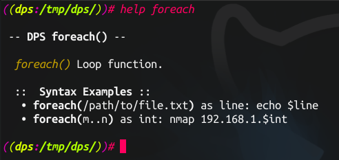
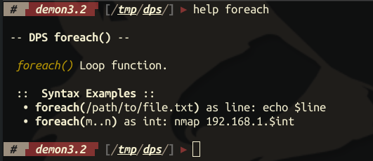

# Demon Pentest Shell
A simple shell wrapper for superior logging capabilities. All commands are logged to daily-labeled files within the ```~/.dps/logs/``` directory with the values of:
***When, Host, Network, Who, Where, What*** The shell also has built-in configuration commands for customizations.
# The Shell
## CONFIGURATION
The `~/.dps/config/dps.ini` file contains the user-defined settings and variables. See the  example config file for syntax. This file and all directories used by DPS are automatically generated in the effective user's home directory within `~/.dps/`.
### Autocomplete Feature

### Built-In Programming Logic

### Shell Themes
These are set with PRMPT_STYL in the `~/.dps/dps.ini` file or with the `dps_config prompt (0-9)` built-in command.
#### DPS Default Theme:
`PRMPT_STYL` value of `0` or `DPS` using `dps_config`


#### Pirate Theme:
`PRMPT_STYL` value of `1` or `PIRATE` using `dps_config`


#### Boneyard Theme:
`PRMPT_STYL` value of `2` or `BONEYARD` using `dps_config`


#### 1980s Theme:
`PRMPT_STYL` value of `3` or `1980S` using `dps_config`



#### Nouveau Theme:
`PROMPT_STYLE` value of `5` or `Nouveau` using `dps_config`



## LOGS
Below is example log output for DPS. All logs are located in `~/.dps/logs/` _with the date used in the file name_. Unlike other shells, which store command history in as session-like manner, DPS will show the command history of all commands issued within a current day from all terminal sessions (WIP).
```
root@demon2.9:/tmp/dps/(dps)# cat ~/.dps/logs/2020-10-18_dps_log.csv                                         
When,Host,Network,Who,Where,What
2020-10-18 11:32:32.253098,demon2.9,ens33:192.168.159.132,root,/tmp/dps,dps_config prompt 3
2020-10-18 11:32:34.377993,demon2.9,ens33:192.168.159.132,root,/tmp/dps,exit
2020-10-18 11:32:40.805349,demon2.9,ens33:192.168.159.132,root,/tmp/dps,ifconfig
root@demon2.9:/tmp/dps/(dps)#                                                                           
```
### SHINY FEATURES
Because this is built with prompt_toolkit, the shell has a lot of great built-in features.
* Use pipes for stdout, stderr just like you would in a native shell
#### KEYBOARD SHORTCUTS
The following keyboard shortcuts are available,
* **CTRL+A** - move the cursor to the beginning of the line
* **CTRL+P** - enter the previous command into the temrinal
* **CTRL+C** - exit the current subprocess gracefully
* **CTRL+R** - search history
* **Up and Down arrows** - flip through command history
#### BUILT-IN COMMANDS
The following are built-in commands,
* **dps_uid_gen** - generate a list of UIDs from a CSV file
* **dps_alias** - display all user-defined aliases in the dps.ini file
* **dps_update** - updates DPS using GitPython as defined by DPS_bin_path in dps.ini file
* **dps_wifi_mon** - set a Wi-Fi device into monitor mode
* **dps_stats** - show log stats
* **dps_config** - set configuration options, such as prompt style
* **clear** - clear the terminal
* **cd** - change current working directory
* **history** - view your command history for your current session file (ALL HISTORY)

## INSTALLATION
To install DPS, simply install the requirements using pip3 and copy the ```dps.py``` into your ```$PATH``` like ```/usr/local/bin```, etc:
```
root@kali:~# cd /tmp
root@kali:/tmp# git clone https://github.com/weaknetlabs/dps.git
root@kali:/tmp# cd dps
root@kali:/tmp/dps# pip3 install -r requirements.txt
root@kali:/tmp/dps# cp dps.py /usr/local/bin/
root@kali:/tmp/dps# dps.py
```
### DEPENDENCIES
This project requires Python3 and the following Python modules,
* **prompt_toolkit** - for TAB autocompletion of $PATH and built-in commands
* **os** - for path object
* **sys** - for exit
* **re** - regular expressions
* **ifaddr** - NIC info
* **socket** - for hostname
* **getpass** - for username
* **subprocess** - executes cmds by passing them to `/bin/bash`
* **configparser** - parses dps.ini file
* **datetime** - for dates and times
* **GitPython** - updates the DPS using this very repository!
